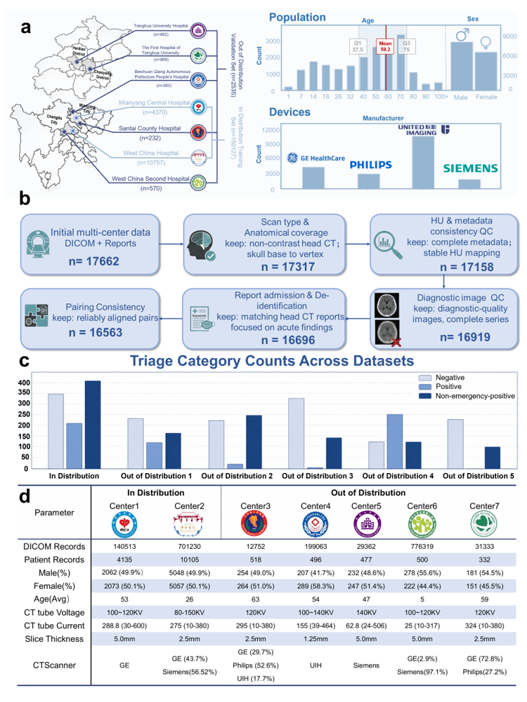

# CHIEF

**CHIEF** is a Chinese-language 3D vision–language foundation model for non-contrast head CT in emergency care. From paired CT volumes and radiology reports, CHIEF learns a single shared representation that drives five clinical tasks: emergency triage, report generation, image-to-text retrieval, fine-tuned multilabel classification, and zero-shot abnormality detection. One pretrained encoder serves every task through a lightweight probe, with no per-task architecture change.

This repository contains the model, data interface, training, inference, and evaluation code for CHIEF.

<p align="center">
  
</p>
<p align="center"><sub>Multicentre cohort construction, quality control, triage distributions, and centre-level distribution shifts.</sub></p>

## Main capabilities

- **Emergency triage:** sorts each examination into `negative`, `non-emergency-positive`, or `positive`.
- **Report generation:** drafts a Chinese radiology report directly from a 3D head CT.
- **Image-to-text retrieval:** surfaces semantically matched prior reports for reference-case support.
- **CQ500 classification:** fine-tuned 14-label abnormality classification.
- **Zero-shot detection:** language-guided scoring across 45 abnormality labels without task-specific fine-tuning.

## Method

CHIEF is pretrained on paired volumetric CT and reports with three objectives that work together on a shared encoder:

- **Bidirectional contrastive alignment** (symmetric InfoNCE) shapes the cross-modal geometry linking CT volumes and reports.
- **Image-conditioned report generation** anchors fine-grained clinical semantics that contrastive learning alone tends to discard.
- **Barlow-style decorrelation** regularizes the representation to suppress protocol- and centre-driven redundancy, supporting cross-centre robustness.

The visual encoder is a 3D CTViT operating on `[1, 128, 128, 128]` volumes; the text encoder is a Chinese BERT (`hfl/chinese-bert-wwm-ext`) and the report decoder is a Chinese GPT-2 (`uer/gpt2-chinese-cluecorpussmall`). Downstream tasks attach lightweight probes to the frozen or fine-tuned shared representation.

## Installation

Python 3.10 is recommended.

```bash
conda create -n chief python=3.10 -y
conda activate chief
pip install -r requirements.txt
```

## Data preparation

The pipeline uses two image stages:

```text
prepared NPY [32, 256, 256]
        ↓ piecewise intensity mapping and trilinear resize
model input [1, 128, 128, 128]
```

Convert a NIfTI, DICOM series, or other supported volume:

```bash
python preprocess.py input.nii.gz output.npy
```

`preprocess.py` is a volume converter. DICOM series selection, complete-head coverage, artifact review, de-identification, and image-report pairing are completed before the manifest is created.

A manifest contains one examination per row. The minimum inference format is:

```csv
sample_id,image_path
case_0001,/path/to/case_0001.npy
```

Training manifests additionally contain the paired report or task label and a `split` column. The triage class order is fixed throughout the code and checkpoints:

```text
0 = negative
1 = non-emergency-positive
2 = positive
```

## Training

Full pretraining and downstream configurations, including optimizer, schedule, loss weights, and the temperature bound, are provided in `configs/` and are ready to reproduce the reported settings.

```bash
# Joint vision-language pretraining
python train.py --config configs/pretrain.yaml \
  --set data.manifest=/path/to/pretrain_manifest.csv

# Emergency triage
python train.py --config configs/triage.yaml \
  --init-checkpoint /path/to/pretrain_best.pt \
  --set data.manifest=/path/to/triage_manifest.csv

# Report generation
python train.py --config configs/report_generation.yaml \
  --init-checkpoint /path/to/pretrain_best.pt \
  --set data.manifest=/path/to/report_manifest.csv

# CQ500 multilabel classification
python train.py --config configs/cq500.yaml \
  --init-checkpoint /path/to/pretrain_best.pt \
  --set data.manifest=/path/to/cq500_manifest.csv
```

## Inference

Use the configuration matching the trained checkpoint:

```bash
python infer.py \
  --config configs/triage.yaml \
  --checkpoint /path/to/triage_best.pt \
  --output predictions/triage.csv \
  --set data.manifest=/path/to/test_manifest.csv
```

For report generation and CQ500, replace the configuration with `configs/report_generation.yaml` or `configs/cq500.yaml`. Retrieval and zero-shot settings are provided in `configs/inference.yaml` through `inference.mode`; the ordered 45-label zero-shot set is stored in `data/examples/zero_shot_labels_45.json`.

Thresholded zero-shot and CQ500 outputs reuse thresholds fitted on an independent validation cohort through `--threshold-validation-predictions` and `inference.thresholds_path`. Thresholds are never fitted on the test cohort, which keeps the reported operating points free of test-set leakage.

## Evaluation

```bash
python evaluate.py \
  --task triage \
  --predictions predictions/triage_with_labels.csv \
  --output metrics/triage.json \
  --n-bootstrap 1000 \
  --seed 42
```

The evaluator accepts both the released column names and the original triage table names (`class_label`, `Pred`, `PROB_NEG`, `PROB_NON`, and `PROB_POS`), and reads UTF-8 and GB18030 CSV files.

Confidence intervals use 1,000 examination-level bootstrap resamples by default. Triage G-mean is computed per class as the geometric mean of sensitivity and specificity, then macro-averaged across classes for which the statistic is defined. For CIDEr, the corpus estimate and per-examination scores are computed once, and the confidence interval bootstraps the fixed per-examination scores rather than recomputing CIDEr in every resample.

A complete command template for all five tasks is provided in `scripts/reproduce_metrics.sh`.

## Repository structure

```text
configs/        training and inference configurations
src/chief/      model, data, training, inference, and evaluation code
scripts/        command templates
train.py        training entry point
infer.py        inference entry point
evaluate.py     metric and bootstrap evaluation
preprocess.py   volume conversion entry point
```

## Data and weights

Private clinical data, institution-specific cohort splits, and trained model weights are not distributed with this repository. The released example files under `data/examples/` document the label banks, negation rules, and terminology mapping used by the pipeline.

## Research-use statement

CHIEF is research software and is not approved for autonomous diagnosis, clinical triage, or treatment decisions. Prospective and site-specific validation is required before clinical use.

Citation information will be updated after publication. The code is released under [CC BY-NC-SA 4.0](LICENSE); third-party components retain their original licences as listed in [THIRD_PARTY_NOTICES.md](THIRD_PARTY_NOTICES.md).
